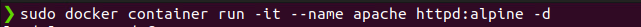
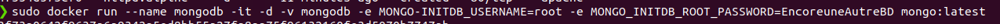

# tp2-420-w45-sf
 Depot du travail 2 de serveur
 
## Section 1

### verification des installations
 - Docker compose
   
 - Docker
   

### Creation de conteneurs
 - Conteneur apache
   

 - Conteneur mongodb
   

   
 
   
