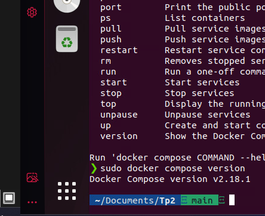
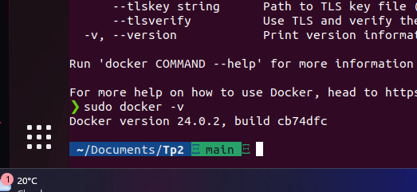

# tp2-420-w45-sf
 Depot du travail 2 de serveur
 
## Section 1

### verification des installations
 - Docker compose
   
 - Docker
   
### Creation de conteneurs
 - Conteneur apache
   ```
   sudo docker run --name mongodb -it --name apache httpd:alpine -d
   ```
 - Conteneur mongodb
   ```
   sudo docker run --name mongodb -it -d -v mongodb -e MONGO-INITDB_USERNAME=root -e MONGO_INITDB_ROOT_PASSWORD=EncoreuneAutreBD mongo:latest
   ```
 - Conteneur reseau
   ```
   sudo docker container run -d -it --name mon_reseau nginx
   ```
   
   

   
 
   
