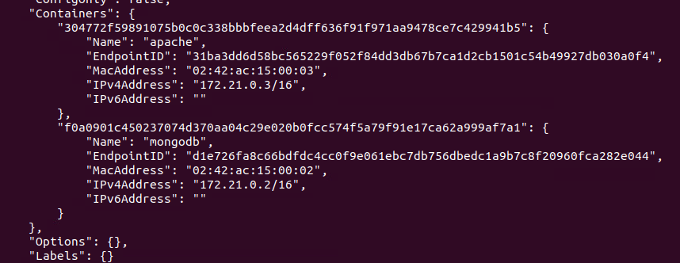

# tp2-420-w45-sf
 Depot du travail 2 de serveur
 
## Section 1

### verification des installations
 - Docker compose
   
 - Docker
   
### Creation de conteneurs
 - Conteneur apache
   ```
    sudo docker container run -dit --name my-apache-app -p 8080:80 httpd:alpine
   ```
 - Conteneur mongodb
   ```
   sudo docker run --name mongodb -dit -v mongodb -e MONGO-INITDB_ROOT_USERNAME=adminmongo -e MONGO_INITDB_ROOT_PASSWORD=EncoreUneAutreBD mongo:latest
   ```
 ### Creation du Reseau

  - creation du reseau
    ```
    sudo docker network create -d bridge mon_reseau
    ```
- ajout des containeurs au reseau
    ```
    sudo docker network connect mon_reseau mongodb
    ```
    ```
    sudo docker network connect mon_reseau apache
    ```

    ### verification reseau
    

    ### verification mongo admin
    
  
   
   

   
 
   
